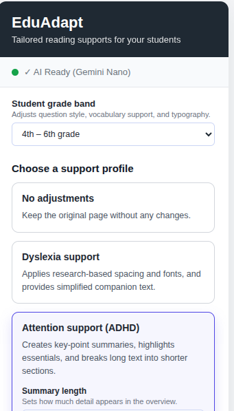
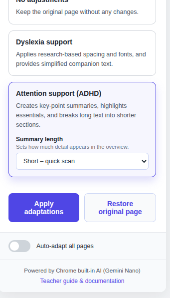
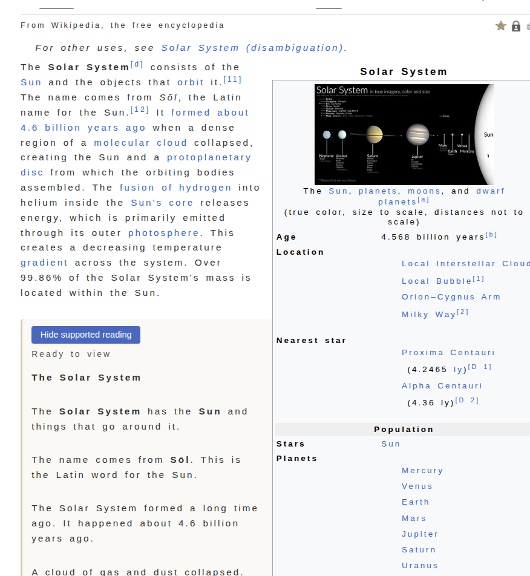
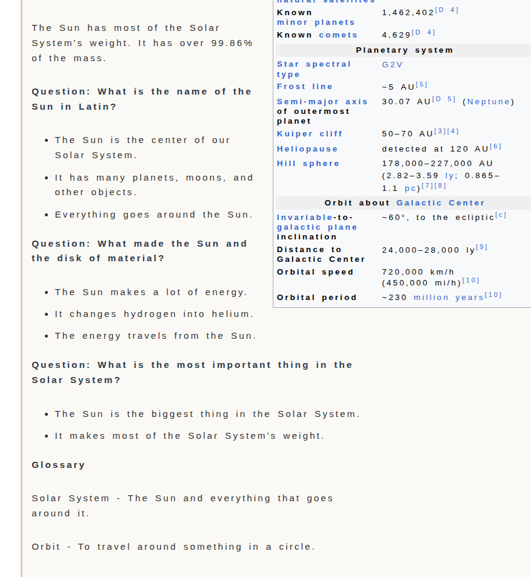
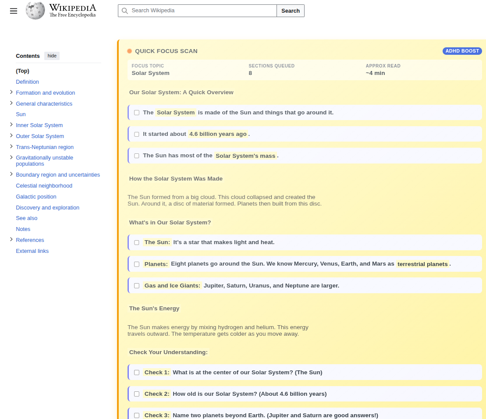

# EduAdapt – Chrome AI Accessibility Companion

**Demo extension that explores how Chrome's on-device Gemini Nano model can reshape web pages for students with diverse learning needs.**

[](https://googlechromeai2025.devpost.com/)  
[](LICENSE.txt)

> **Important:** EduAdapt is a prototype. The learning strategies have been compiled through AI-assisted research and iterative feedback from a doctoral researcher in special education. They illustrate an approach and are **not** a substitute for professional recommendations, classroom accommodations, or clinical interventions. Any real-world deployment must be co-designed with teachers, caregivers, and neurodivergent learners.

---

## For Hackathon Judges

**Project Category:** Chrome Extension  
**Challenge:** Google Chrome Built-in AI Challenge 2025

### Quick Summary
EduAdapt is an AI-powered learning accessibility tool that transforms web content in real-time for students with ADHD, Dyslexia, and other learning differences. Unlike traditional accessibility tools that only adjust visual styling, EduAdapt uses Chrome's **on-device Gemini Nano** to intelligently restructure content based on research-backed teaching strategies.

### Chrome AI APIs Used
 **Prompt API** - Core text transformation engine for profile-aware content rewrites  
**Summarizer API** - Generates structured quick overviews for ADHD support mode

### Problem Solved
Students with learning differences often struggle with dense web content that isn't adapted to their cognitive needs. EduAdapt addresses this by:
- Providing **on-demand text simplification** for dyslexic readers (respecting autonomy)
- Creating **structured, task-oriented summaries** for ADHD learners (reducing overwhelm)
- Adapting content based on **grade level** (1-3, 4-6, 7-8) for age-appropriate language
- Running **entirely client-side** (privacy-first, works offline, no API costs)

### Key Innovation
**Adaptive pedagogy meets client-side AI:** EduAdapt doesn't just simplify text—it applies differentiated instruction strategies informed by special education research, dynamically adjusting for both learning profile AND developmental stage.

### Quick Test Instructions

**Prerequisites** (5 minutes):
1. Chrome 138+ (Dev/Canary) - [Download here](https://www.google.com/chrome/dev/)
2. Enable flags:
   - `chrome://flags/#prompt-api-for-gemini-nano` → **Enabled**
   - `chrome://flags/#optimization-guide-on-device-model` → **Enabled BypassPerfRequirement**
3. Restart Chrome
4. Visit `chrome://components/` → Find "Optimization Guide On Device Model" → Click "Check for update"
5. Wait for Gemini Nano download (~1.5 GB, 5-10 min)
6. Verify in DevTools console: `await ai.languageModel.capabilities()` should show `available: "readily"`

**Install Extension** (2 minutes):
1. Clone/download this repo
2. Visit `chrome://extensions/`
3. Enable "Developer mode" (top-right toggle)
4. Click "Load unpacked" → select the `eduadapt` folder
5. Pin the EduAdapt icon to toolbar

**Test Scenario 1 - Dyslexia Support** (3 minutes):
1. Visit any article (e.g., [Wikipedia: Solar System](https://en.wikipedia.org/wiki/Solar_System))
2. Click EduAdapt icon → Select **Dyslexia** profile
3. Choose **Grade 4-6**
4. Click **Apply adaptations**
5. **Observe:** Typography changes (increased spacing, sans-serif font, warm background)
6. **Click "Expand" on any paragraph:** See simplified rewrite with comprehension question
7. **Scroll to end of expanded section:** Simple glossary lists 3-4 key words with definitions

**Test Scenario 2 - ADHD Support** (3 minutes):
1. Visit a different article (e.g., [BBC News article](https://www.bbc.com/news))
2. Click EduAdapt → Select **ADHD** profile
3. Choose **Grade 7-8**
4. Click **Apply adaptations**
5. **Observe:** Instant "Quick Overview" banner appears (placeholder to reduce waiting frustration)
6. **Wait for full structured summary:** Key topics broken into digestible sections (processing time varies by article length and device)
7. **Use the checklist:** Each paragraph becomes a completable task with checkboxes

**Test Scenario 3 - Grade Band Differences** (2 minutes):
1. Try the same article with **Grade 1-3** (Dyslexia mode)
2. **Notice:** Text converts to UPPERCASE, simpler vocabulary, no comprehension questions
3. Switch to **Grade 7-8** (Dyslexia mode)
4. **Notice:** More reflective questions, optional glossary, maintained complexity

### Judging Criteria Highlights

**Functionality (Scalability):**
- Works on any text-heavy webpage (news, Wikipedia, blogs, educational sites)
- Supports 3 grade bands × 2 profiles = 6 distinct adaptation modes
- Persists settings across sessions for continuous support
- Fully client-side = works globally without regional API restrictions

**Purpose (Real-world problem):**
- Addresses the needs of students with learning differences
- Enables independent web reading for neurodivergent learners
- Reduces teacher workload in creating differentiated materials
- Repeat-use by design: auto-adapt mode for persistent support

**Content (Creativity):**
- Research-informed pedagogy (not just generic simplification)
- Grade-aware prompting system
- Progressive disclosure UI (respect for user autonomy)
- Visual hierarchy optimized for focus and attention

**User Experience:**
- Zero-latency typography changes (instant feedback)
- Progressive enhancement (placeholders while AI generates content)
- One-click restore to original content
- Simple glossary at end of expanded sections for vocabulary support

**Technical Execution:**
- Sophisticated prompt engineering with grade-band and profile-specific templates
- Queue-based prefetching system (begins processing paragraphs before user interaction in dyslexia mode)
- Session caching to reduce redundant API calls
- Fallback handling when Summarizer API unavailable
- Clean architecture: popup ↔ content script ↔ service worker
- **Known limitation:** Initial content processing time varies by article length and device performance; future optimizations include parallel processing and response streaming

### Repository Contents
- Complete source code with comments
- MIT License (open source)
- Detailed installation instructions
- Architecture documentation
- Research disclaimers and acknowledgements

### Demo Video
https://youtu.be/oMkCbqEe06g?si=1zaO_jPJMboXuqLP

### Questions or Issues?
Contact: davide.iotti123@gmail.com

---
### Screenshots

**Popup Interface**




**Dyslexia Mode - Text Adaptation**




**ADHD Mode - Checklist & Quick Overview**


## Why EduAdapt?

Most accessibility extensions tweak fonts and colors. EduAdapt goes further by:

- Using **Chrome's built-in Gemini Nano** to rewrite content locally (no external API calls, no data leaves the device).
- Generating **dynamic, research-inspired teaching supports**: simplified rewrites, checklists, and comprehension prompts.
- Allowing teachers to **dial in grade bands** (1–3, 4–6, 7–8) so language difficulty, follow-up questions, and vocabulary supports match age expectations.
- Keeping the original article visible so students and educators can compare source vs. adapted text.

---

## Core Features

| Capability | How it Helps | Notes |
|------------|--------------|-------|
| **Profile-aware rewrites** | Tailors text for Dyslexia or ADHD learners. | All logic runs in `background/service-worker.js` with Gemini Nano. |
| **Grade bands** (1–3, 4–6, 7–8) | Adjusts tone, question complexity, typography, and glossary use. | Selectable in the popup; stored with `chrome.storage.sync`. |
| **Teacher-oriented UI** | Clean dashboard with embedded profile settings + grade selector. | `popup/popup.html`, `popup/popup.js` |
| **Dynamic support sections** | Dyslexia mode adds expandable panels with simplified paragraphs + comprehension question. | Prefetch queue avoids blocking on huge sections. |
| **Quick overview for focus** | ADHD mode creates an instant "Quick Overview" banner and bullet checklist with checkboxes. | Summary uses the Summarizer API when available, with fast placeholders. |
| **Simple glossary** | At the end of expanded sections, a simple word list (3-4 key terms with definitions) appears for vocabulary support. | Grade-specific: 1-3 get 3 words, 4-6 get 4 words, 7-8 get 2 optional words. |

---

## Learning Profiles Explained (with research rationale)

The extension encodes strategies relayed by a PhD researcher who studies neurodivergent literacy. Each feature exists to demonstrate the approach.

### Dyslexia Support

**Disclaimer:** I am not a specialist in learning disabilities or neurodevelopmental disorders. For any real-world application, collaboration with domain experts—educators, psychologists, and accessibility researchers—is essential. The features described here are informed by scientific papers and guidance from colleagues who have studied educational psychology and special needs pedagogy. Their insights shaped the following approach:

**Design philosophy:** Many dyslexic readers benefit primarily from typographic adjustments and do not require simplified text by default. Forcing simplified content immediately can be counterproductive. Instead, the interface respects the reader's autonomy by offering optional expansions on a per-paragraph basis.

- **Typography tuned to research:** 0.20em letter spacing, 2.0 line height, sans-serif font stack (Arial/Verdana/Helvetica Neue), warm background (#faf8f3).
- **Optional simplified companion text:** Every paragraph includes an expand button that reveals a rewritten version with short sentences, concrete vocabulary, and bolded focus terms. The original text remains visible and accessible at all times.
- **Comprehension prompts:** After each simplified paragraph, a "Question:" line probes understanding (grades 4–8). Grades 1–3 suppress questions and convert text to uppercase for improved readability.
- **Simple glossary:** At the end of each expanded section, a simple word list appears with definitions (grades 1–3 get 3 words, grades 4–6 get 4 words, grades 7–8 get 2 optional words).
- **No preloading for simplified text:** Since users begin by reading the typographically enhanced original, simplified versions are generated only when requested. This avoids unnecessary API calls and latency, as the disorder profile benefits most from immediate access to the styled original content.

### ADHD Support

**Disclaimer:** I am not a specialist in attention-deficit disorders or cognitive-behavioral interventions. For production use, consultation with ADHD specialists, occupational therapists, and UX accessibility experts is strongly recommended. The strategies implemented here draw from academic literature and advice from peers with backgrounds in special education. Their recommendations informed the following structure:

**Design philosophy:** Learners with ADHD benefit from immediate feedback, progressive disclosure, and task-oriented interaction patterns that sustain attention and reduce cognitive overwhelm. The interface prioritizes quick wins, transparent progress tracking, and flexible depth control.

- **Estimated reading time:** Each article displays an approximate reading duration at the top, helping users assess commitment and plan their engagement.
- **Quick Overview banner:** A lightweight first-sentence summary appears immediately upon page load, providing instant context and reducing initial wait-related frustration. This placeholder is replaced seamlessly once the API-generated structured summary is ready.
- **Structured summary with topic preview:** The full summary breaks the content into digestible topics or key points, allowing users to grasp the article's scope before diving into the full text. Users can choose to engage only with this high-level view or proceed to detailed sections.
- **Checklist workflow:** Each paragraph or section is converted into an interactive task item with a checkbox. Users can mark sections as "completed," providing a sense of accomplishment and supporting self-monitoring and executive function.
- **Grade-aware tone:** Lower grade levels (1–3) use uppercase text and simple action-oriented language (e.g., "READ THIS PART"). Middle school levels (4–8) employ metacognitive prompts and planning-oriented statements (e.g., "Review this section and check it off when done") to encourage reflection and strategy use.
- **Progressive paragraph restructuring:** While the summary loads first, individual paragraphs are simultaneously reprocessed in the background using the same simplification methodology. Users can expand any paragraph for a more detailed, ADHD-friendly rewrite, ensuring flexible depth without upfront delay.
- **Distraction reduction:** Headings maintain high contrast for wayfinding, paragraphs are visually chunked, and only the first visible section loads synchronously. Subsequent content appears on demand to prevent information overload and scrolling fatigue.
- **Frequently Asked Questions (FAQ) section:** Common questions about the content are surfaced early, giving users quick access to anticipated queries and reducing the need to search through dense text.

## Grade Bands & Tuning Controls

| Grade Band | Dyslexia behaviour | ADHD behaviour |
|------------|--------------------|----------------|
| **1st – 3rd** | Entire adaptation in uppercase, no questions, glossary limited to three core words. | 2–3 uppercase checklist items, very short sentences. |
| **4th – 6th** | Comprehension question after each paragraph, glossary with up to four entries. | 3–4 checklist items with brief encouragement. |
| **7th – 8th** | More reflective questions (styled differently), glossary optional (max two entries). | Up to 5 checklist items focused on planning, future steps. |

All selections (profile, grade band, dyslexia simplification level, ADHD summary length, auto-adapt toggle) persist across browsing sessions.

---

## Installation & Setup

### Prerequisites

1. **Chrome 138+** (Dev, Canary, or Stable once Gemini Nano GA).  
2. Enable flags:  
   - `chrome://flags/#prompt-api-for-gemini-nano` → **Enabled**  
   - `chrome://flags/#optimization-guide-on-device-model` → **Enabled BypassPerfRequirement**  
3. Restart Chrome, visit `chrome://components/`, locate **Optimization Guide On Device Model** and "Check for update". Wait for the on-device Gemini download (~1.5 GB).  
4. Verify availability in DevTools console:
   ```js
   await LanguageModel.availability(); // "readily" or "available"
   ```

### Load the Extension

```bash
git clone https://github.com/Davide4599/EduAdapt-AI-Powered-Learning-Accessibility.git
cd eduadapt
```

1. Visit `chrome://extensions/`  
2. Enable **Developer mode**  
3. Click **Load unpacked** → choose the `eduadapt` folder  
4. Pin the EduAdapt icon for quick access

---

## Using EduAdapt

1. Click the toolbar icon.  
2. Choose a grade band (defaults to 4th–6th).  
3. Select Dyslexia / ADHD (or "No adjustments").  
4. Tailor profile options (e.g., dyslexia simplification level).  
5. Hit **Apply adaptations**. The content script (`content/content.js`) extracts paragraph blocks, calls the background service worker for AI rewrites, and streams results onto the page.  
6. Use **Restore original page** to revert.

Tip: Enable **Auto-adapt all pages** for continuous support (stored with `chrome.storage.sync`).

---

## Architecture Snapshot

```
popup (UI) ─┬─> content script (page extraction + rendering)
            │
            └─> service worker (background AI orchestration)
                  ├─ Gemini Nano Prompt API (general rewrites)
                  ├─ Summarizer API (ADHD quick overview)
                  └─ Per-profile prompt templates + retry logic
```

- **Prefetch queue** in `content/content.js` handles dyslexia sections (parallel limit + size guard).  
- **Glossary + grade styling** is injected as CSS in `applyCSSForProfile`.  
- **Retry + session caching** lives in the service worker to manage Gemini sessions efficiently.

---

## Roadmap & Next Steps

### Completed Features
- **Grade-aware controls (1–3, 4–6, 7–8):** Adaptive content delivery and tone based on developmental stage.
- **Placeholder-first loading for ADHD profile:** Immediate visual feedback with progressive enhancement to reduce perceived latency and maintain engagement.

### In Progress
- **Performance optimization:** Current processing time varies by article length and device performance. Already implemented: prefetch queue that begins paragraph processing before user interaction (dyslexia mode). Next: parallel processing across multiple paragraphs, response streaming, and prompt compression techniques.
- **Rewriter API integration for dyslexia support:** Awaiting origin trial token to leverage browser-native text simplification capabilities for improved speed and reliability.

### Loading Time Improvements Tried
- Cached Gemini sessions and Summarizer instances to avoid repeated start-up costs.
- Trimmed ADHD quick-scan input to core heading + highlights, cutting token load.
- Prioritised short dyslexia paragraphs with a preview micro-pass while full rewrites finish.

### Planned Development
- **Personalized user profiles:** Enable educators to create, manage, and refine individualized accommodation settings for each student. Profiles will support granular feature control (typography, simplification thresholds, sensory adjustments, interaction modes), persist across sessions, and evolve as learners progress or preferences shift. This feature addresses the heterogeneity of neurodevelopmental profiles and aligns with IEP-driven support models.
- **Qualitative user research:** Conduct structured feedback sessions with educators, special education specialists, and students to validate design decisions, identify gaps, and iteratively improve accessibility features.

---

## Acknowledgements

- Guidance on literacy strategies from a doctoral researcher specialising in dyslexia and ADHD support.  
- Chrome Built-in AI team for shipping on-device Gemini Nano tooling.  
- Community resources from the British Dyslexia Association, CAST UDL, and W3C Accessibility guidelines that informed the baseline typography and spacing choices.
- My mother, who inspired the idea for this project with her stories about her work and who gave me practical advice.
- All my friends who specialized in university courses in this field, who proved to be an important source of information.

---

## License

MIT © 2025 EduAdapt contributors. See [LICENSE.txt](LICENSE.txt) for details.
